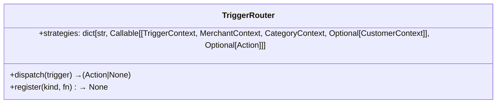

# Architecture — Vera Message Engine

**Status**: Draft v1.0 (pre-implementation)
**Last updated**: 2026-08-30
**Sources**: `challenge-brief.md`, `challenge-testing-brief.md`, `engagement-design.md`, `engagement-research.md`, `judge_simulator.py`

---

## 1. System Context Diagram

```mermaid
%% HLD — Context-level diagram
%% Architecture as seen from the judge harness

flowchart TB
    subgraph Judge_Harness
        direction LR
        judge: magicpin Judge Harness
    end

    subgraph Bot
        direction LR
        api[FastAPI / uvicorn]
        ctx[ContextStore (in-memory)]
        comp[ComposerEngine]
        conv[ConversationEngine]
        logs[Logger]
    end

    subgraph External_LLM
        direction LR
        llm[Optional LLM (temp=0; optional polish)]
    end

    judge --- api
    api --- ctx
    api --- comp
    api --- conv
    comp --- llm
    conv --- llm
    ctx --- llm
    comp --- logs
    conv --- logs

    classDef bot fill:#e3f2fd,stroke:#1565c0,stroke-width:2px
    classDef judge fill:#fff3e0,stroke:#ef6c00,stroke-width:2px
    classDef llm fill:#f3e5f5,stroke:#7b1fa2,stroke-width:1px,stroke-dasharray: 5 5
```

## 2. High-Level Component Architecture

The bot is a single-process Python service (3.11+, FastAPI, uvicorn). All state lives in-process:

1. **API Layer** (`main.py`): 5 endpoints + healthz probe, routes JSON → components.
2. **ContextStore** (`store.py`): thread-safe dicts keyed by `(scope, context_id)`; stores `{version, payload}` with idempotent version check; auto-expires on version overwrite; initialised at warmup from all 255 base contexts.
3. **ComposerEngine** (`composer/engine.py`): the core `compose(category, merchant, trigger, customer?) -> {body, cta, send_as, suppression_key, rationale}` pipeline; pure-Python deterministic rules-first design; optional `LLM polish` (temp=0) behind strict budget guard; every output has a `rationale` that accurately describes the decision.
4. **ConversationEngine** (`conversation/handler.py`): `/v1/reply` logic: auto-reply detection, explicit intent transition, graceful exit, off-topic handling, multi-language switch.
5. **LLM Polish (optional)** (`composer/llm_polish.py`): thin LLM call (temperature=0) to refine wording after deterministic base composition; strictly budgeted: used at most N tokens per message, with deterministic fallback if budget exceeded; inline prompts reference only values from contexts, never invent data.

### 2.1 Data-flow diagram (tick → compose → send → reply)

```mermaid
flowchart TD
    TickStart[Tick arrives: {now, available_triggers[]}] -->|for each trigger| CheckCtx[ContextStore: merchant/context/trigger/payload available?]
    CheckCtx -- no --> SkipSkip[Skip this trigger]
    CheckCtx -- yes --> LoadCtx[Load category/merchant/trigger/customer contexts from store]
    LoadCtx --> DetermineKind[TriggerRouter: kind → strategy dispatch table]
    DetermineKind --> SignalSel[SignalSelector: evaluate merchant signals vs. trigger urgency/payload]
    SignalSel --> PickSlots[SlotExtractor: pull facts from category.offer_catalog / merchant.performance / trigger.payload]
    PickSlots --> Voice[VoiceRenderer: category tone/vocab rules; enforce taboos; inject language codes {hi} etc.]
    Voice --> CTA[CTAPolicy: one CTA only; binary YES/STOP for action triggers; none for pure info; enforce placement]
    CTA --> Dedup[SuppressionCheck: exp key expiry; global anti-repetition hash of body signatures]
    Dedup --> GenerateAction[ComposeAction: {conversation_id, merchant_id, customer_id, send_as, template_name?, template_params?, body, cta, suppression_key, rationale}]
    GenerateAction --> ReturnTick["/v1/tick returns {actions[]}"]
    ReturnTick --> JudgeReply[Judge sub-LLM plays merchant/customer → POST /v1/reply]
    JudgeReply --> ConversationHandler[ConversationEngine: reply handler → {action: send|wait|end}]
    ConversationHandler -->|send| NewTickCycle[Next tick → composition]
    ConversationHandler -->|end| ConversationEnd[Conversation ends for this ID]
    ConversationHandler -->|wait| Backoff[wait_seconds back-off; next tick re-checks]
```

## 3. Low-Level Diagrams & Component Specs

### 3.1 ComposerEngine Pipeline (inside `composer/engine.py`)

The compose function is the **single source of truth** for message generation. Its pipeline is:

```mermaid
flowchart LR
    A[Input: category: dict, merchant: dict, trigger: dict, customer: dict|null] --> B[TriggerRouter: identify kind → strategy function]
    B --> C[SignalSelector: evaluate merchant.performance signals vs. trigger urgency/payload]
    C --> D[SignalDecision: yes/no go/no-go; if no → rationale="no compelling signal this tick"]
    D -->|no| E[Return: {body, cta="none", send_as="vera", suppression_key, rationale="no compelling signal"}]
    D -->|yes| E
    E --> F[SlotExtractor: pull concrete facts]
    F --> G[TemplateFiller: fill scaffold with {{1}}/{{2}}/… params]
    G --> H[VoiceRenderer: enforce category voice, taboos, language code-mix]
    H --> I[CTAPolicy: final CTA placement check]
    I --> J[SuppressionCheck: exp_key expiry + global dedup hash]
    J --> K[RationaleBuilder: explain why this now, what it achieves]
    K --> L[Output: {body, cta, send_as, suppression_key, rationale}]
```

**Determinism**: step order is fixed; no RNG; `hash(body)` uses sorted dict of context values; every step is pure function of its inputs.

### 3.2 ConversationHandler LLD

The `/v1/reply` handler has three active code paths (guarded by `message` content from the simulated merchant/customer):

1. **Auto-reply detection**: if the last 2–3 incoming messages are verbatim (same canned WA Business reply), return `{action: "end", rationale="auto-reply detected: merchant auto-responded 3+ times"}`.

2. **Intent transition**: if merchant message contains any of `["done", "sending", "draft", "here", "confirm", "proceed", "next"]` AND does NOT contain any qualifying word `["would you", "do you", "can you tell", "what if", "how about"]`, then switch to action mode: emit body referencing what was requested, `cta: "open_ended"` (or appropriate), `rationale="merchant committed — switching to action mode"`.

3. **Graceful exit / off-topic**: if merchant says `["stop", "don't message me", "not interested", "unsubscribe"]` OR asks a curveball outside the vertical (`"can you also help me file my GST?"`), then return `{action: "end", rationale="merchant ended conversation / off-topic: …"}`.

Default case: return `{action: "send", body=next_nudge, cta=appropriate, rationale="continuing the conversation flow"}`.

### 3.3 ContextStore LLD

```mermaid
classDiagram
    class ContextStore {
        +ctx: dict[(scope, context_id), {version: int, payload: dict}]
        +lock: threading.Lock
        +push(scope, context_id, version, payload) → accepted, ack_id
        +get(scope, context_id) → Optional[dict]
        +idempotent?(scope, context_id, version) → bool
        +replace(scope, context_id, new_version, new_payload) → replaced
        +clear() → None
    }
```

Thread-safety: all mutations acquire `lock` before read-modify-write; `get` is lock-free (copy-on-read via `copy()` of payload reference); warmup fully populates store before ticks begin.

### 3.4 Trigger Router LLD



Pre-registered strategy kinds (per engagement-design.md):

| Kind | Scope | Purpose |
|---|---|---|
| research_digest | merchant | External research digest release; source-citation framing |
| recall_due | customer | 6-month recall window for patient |
| perf_spike | merchant | Yesterday views +28% vs avg |
| perf_dip | merchant | Calls dropped 40% week-over-week |
| milestone_reached | merchant | Crossed X reviews |
| dormant_with_vera | merchant | No Vera message in 14d |
| customer_lapsed_soft | customer | 3-6mo since last visit |
| appointment_tomorrow | customer | Booking exists for next day |
| festival_upcoming | merchant | Festival within N days |
| weather_heatwave | merchant | Temp > 42°C city |
| competitor_opened | merchant | New venue nearby |
| review_theme_emerged | merchant | 3+ reviews mention theme |

Any unknown kind → default graceful-degradation (compose a generic-but-grounded nudge from available data, or skip).

### 3.5 Slot Extractor LLD

The slot-filling step determines concrete values injected into the message body. It operates a priority chain:

1. `trigger.payload` → nearest fact source (e.g., `{last_visit, due_date}` for recall; `{top_item}` for research digest)
2. `merchant.performance` → real numbers (views, calls, ctr, deltas) if signal matches trigger urgency
3. `merchant.offers` → active offer title with price (`"Dental Cleaning @ ₹299"`)
4. `merchant.identity.locality` → city/locality name
5. `category.offer_catalog` → fallback service+price patterns when merchant has no active offers
6. `category.peer_stats` → comparative benchmarks (`peer median CTR 3.0%`)
7. If nothing concrete available → `rationale="no compelling signal this tick"` and emit no action

Each slot fills a template placeholder `{{slot_name}}`. If a slot is missing, it is omitted and the message re-flows gracefully (no blank gaps). If more than 3 mandatory slots are missing, the trigger is skipped entirely.

## 4. Component Summary Table

| Component | Language / Tech | Key Data | Public API |
|---|---|---|---|
| API | Python FastAPI + uvicorn | Endpoint routing | `/v1/*` |
| ContextStore | Python dict + threading.Lock | `(scope,cid) → {version,payload}` | context_push, context_get, clear |
| ComposerEngine | pure-Python rules + optional LLM temp=0 | compose(category, merchant, trigger, customer?) → {body, cta, send_as, suppression_key, rationale} | internal (called from tick handler) |
| ConversationHandler | Python dict dispatch + message parsing | /v1/reply body → {action, body?, wait_seconds?, rationale?} | reply endpoint |
| TriggerRouter | dict[str, Callable] | kind → strategy fn lookup | internal |
| LLM Polish (optional) | OpenAI/Anthropic/Gemini API, temp=0 | refine wording after deterministic base | internal, guarded by token budget |

## 5. Deployment Notes

- Single process; uvicorn on port 8080 (or env `PORT`).
- In-memory state sufficient for test window (60 simulated minutes); `POST /v1/teardown` optional wiper.
- No DB required; all contexts live in store dict.
- Public URL must expose HTTPS (submission) or HTTP (local judge); all 5 endpoints under `/v1/`.
- Rate limit: 10 req/sec from judge — FastAPI default + uvicorn thread pool handle this.
- Timeout: 30s judge ceiling; bot must complete tick/reply within 15s client-side (simulator default); return empty `actions: []` if overrun.

## 6. Architecture Decision Records (ADRs)

| ADR | Decision | Rationale |
|---|---|---|
| ADR-001 | Deterministic rules-first composer (no LLM inside bot v1) | Guarantees < 2s tick latency, byte-identical outputs for same inputs, avoids hallucination risk (penalty −2) and 30s judge timeout. LLM used only as optional post-polish with strict token budget. |
| ADR-002 | In-memory store only | Spec says "storing in memory is fine; just don't restart between calls." No DB complexity, zero provisioning cost, satisfies determinism requirement. |
| ADR-003 | Single CTA per message | Penalized in scoring (−2 for multiple CTAs); clarity for merchant; anti-repetition easier with one ask per send. |
| ADR-004 | Context versioning: higher replaces, same/lower is no-op | Per testing brief §2.1; atomically prevents stale data while allowing incremental updates. |
| ADR-005 | Template-first scaffolding, slot-filling for body | Avoids blank gaps; enforce single CTA placement; supports both pure-info and action-trigger messages. |
| ADR-006 | Voice/tone per category from brief §1 | Prevents dentist messages sounding like retail promos; preserves taboos; anchors category_fit score. |
| ADR-007 | Auto-reply detection within 2 turns | Matches production Vera pain; aligns with `judge_simulator.py` `_auto_reply` test which sends 4 auto-replies and expects bot to exit after detecting the pattern. |
| ADR-008 | Rationale must be factually accurate w.r.t. output | Judge scores it and cross-checks; if rationale says "merchant CTR below peer" but body has no CTR, score drops. |